# AIMP Discord Rich Presence 1.5.3 for AIMP 4, 5 and 6 (Windows x86 / x64 + Linux)

Discord Rich Presence plugin for AIMP 4, 5 and 6 (AIMP 3 with limitations) with its own settings tab inside AIMP's preferences -
on Windows **and** Linux, in English, German, Russian and Ukrainian, with a live preview, update check and
diagnostics. See the changelog for what is new: [English](CHANGELOG.md) · [Deutsch](langs/changelog.de.md) ·
[Русский](langs/changelog.ru.md) · [Українська](langs/changelog.uk.md)

| Platform | File |
|---|---|
| **All platforms in one package** | `aimp_discord_rpc.aimppack` - AIMP picks the right build |
| Windows, AIMP **64-bit** (manual) | `aimp_discord_rpc-windows-x64.zip` - `aimp_discord_rpc.dll` |
| Windows, AIMP **32-bit** (manual) | `aimp_discord_rpc-windows-x86.zip` - `aimp_discord_rpc.dll` |
| Linux, **native** AIMP for Linux (x86_64) | `aimp_discord_rpc-linux-x86_64.zip` - `aimp_discord_rpc.so` |
| Linux, Windows AIMP running in **Wine** | the Windows DLL matching your AIMP (x86 or x64) - see [Linux](#linux) |
| Windows, **AIMP 3** (manual only) | `aimp_discord_rpc-windows-x86.zip` - see [AIMP 3](#aimp-3-limited-support) |

Author: **Fl4sh**

## Preview

How it looks in Discord - while playing (live progress bar) and paused:

<p>
  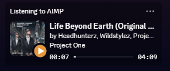
  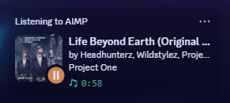
</p>

In the member list:

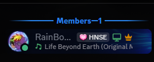

## Features

- Track title / artist / album on your Discord profile with Discord's **native progress bar** ("Listening to AIMP")
- Album cover:
  - the file's own cover (tags MP3 / FLAC / M4A or folder image) is uploaded to **x0.at** (no account / key needed),
    catbox.moe or Imgur (Client-ID); every upload is checked, and if a host fails another one stands in
  - online lookup without upload: **Spotify** (free developer app), **Deezer**, **Apple Music / iTunes**, **Bandcamp**, **Discogs** (free token), **MusicBrainz + Cover Art Archive**
  - artist check against every hit to avoid wrong covers; covers are cached on disk
- AIMP logo as fallback if no cover is found
- Clickable song title: opens a YouTube search for artist + title (own link optional)
- PreMiD friendly: while AIMP is paused its presence is hidden, so your browser activity (PreMiD) is shown instead
- Works out of the box - no Discord application or key needed
- Own settings tab: *Preferences -> Plugins -> Discord Rich Presence* (General / Display / Cover art / Sources /
  Advanced / About), built with AIMP's own UI - follows the AIMP skin (light / dark) and is the same on Windows and Linux
- **Live preview** of your Discord profile card and member list entry while you edit the texts
- **Cover preview**: the current cover and where it comes from (tags, folder, Deezer, iTunes, ...)
- **Follows AIMP's language**: English, German, Russian and Ukrainian built in (can also be chosen); more languages
  can be added as simple text files
- **Update check** (daily / weekly / monthly / at every AIMP start, or off): new versions are downloaded from GitHub,
  checked (SHA-256) and opened in AIMP, which installs them
- **Diagnostics**: connection details, test presence, reconnect, recent log, export / import of the settings
- Text templates with placeholders: `%artist% %title% %album% %albumartist% %genre% %year% %track% %playlist% %filename% %ext% %pos% %dur% %percent% %bar% %status%`
- Play/pause small icon, paused behaviour (show "Paused" / hide / hide after N minutes)
- Internet radio: shows the current song of the stream; can also be hidden completely
- Hide for paths or playlists containing given text (e.g. podcasts, audiobooks)
- Auto reconnect when Discord starts later, live connection status, presence is cleared when AIMP closes
- Small and light: about 0.5 MB per build, the background threads sleep while there is nothing to do

## Requirements

- AIMP 4, 5 or 6: Windows 32-bit or 64-bit, or the native Linux version (x86_64) - fully supported, including the
  settings tab, the `.aimppack` installation and automatic updates
- AIMP 3: limited support - see [AIMP 3](#aimp-3-limited-support)
- Discord **desktop app** (the browser version of Discord cannot receive Rich Presence).
  On Linux the native client, Flatpak, Snap and Vesktop (Flatpak) are found automatically.
- In Discord: *User Settings -> Activity Privacy -> "Share your detected activities with others"* must be on

## Install

Download the latest version from the [Releases](../../releases) page. The `.aimppack` contains the builds for
Windows 32-bit, Windows 64-bit and Linux - AIMP installs the one it needs. If you install a single DLL instead,
**pick the one that matches your AIMP**: a 64-bit AIMP only loads the x64 DLL, a 32-bit AIMP only the x86 DLL
(*Help -> About* shows which one you have).

There are three ways to install it on Windows:

### Option 1: AIMP package (easiest)

1. Download `aimp_discord_rpc.aimppack`
2. **Double-click** the file - AIMP opens and installs the plugin automatically (32-bit or 64-bit is picked for you)
3. Restart AIMP if it asks you to

### Option 2: Install button in AIMP

1. Download `aimp_discord_rpc.aimppack` **or** `aimp_discord_rpc.dll`
2. In AIMP open *Preferences -> Plugins* and click **Install** at the bottom
3. Select the downloaded file and restart AIMP if asked

### Option 3: Manual

1. Download `aimp_discord_rpc-windows-x64.zip` (64-bit AIMP) or `aimp_discord_rpc-windows-x86.zip` (32-bit AIMP)
2. Extract it into `AIMP\Plugins\` - this creates `AIMP\Plugins\aimp_discord_rpc\aimp_discord_rpc.dll`
   (the folder name must match the DLL name)
3. Restart AIMP

### After installing

Make sure the plugin is ticked in *Preferences -> Plugins*. As soon as music is playing, Discord shows
"Listening to AIMP". All options are in *Preferences -> Plugins -> Discord Rich Presence*.

**Updating:** since 1.5 the plugin looks for new versions itself (*About* tab) and opens them in AIMP; once AIMP has
installed the new version, the plugin restarts AIMP so it is active right away. You can also install a new version
the same way as above - your settings are kept.

### AIMP 3 (limited support)

AIMP 3 cannot install `.aimppack` files and has no settings pages for plugins. The presence itself works (title,
artist, progress bar, covers, pause behaviour, ...), but the plugin has to be installed by hand and is set up in its
settings file:

1. Download `aimp_discord_rpc-windows-x86.zip` (AIMP 3 is always 32-bit)
2. Extract it into the `Plugins` folder of AIMP 3 - this creates `AIMP3\Plugins\aimp_discord_rpc\aimp_discord_rpc.dll`
3. Restart AIMP 3 and make sure the plugin is ticked in *Preferences -> Plugins*
4. Options: `DiscordRPC.ini` in AIMP's profile folder (usually `%APPDATA%\AIMP\`) - created on the first start with all options and their defaults;
   changes are applied while AIMP is running

Updates are not installed automatically in AIMP 3 - install a new version the same way (your settings are kept).

## Settings

All options are in AIMP under *Preferences -> Plugins -> Discord Rich Presence* - on Windows and Linux. The page is
built with AIMP's own UI controls, so it follows the current AIMP skin, and it is shown in AIMP's language. Links
(GitHub, Developer Portal, Spotify, Discogs) are opened by AIMP in your browser.

**General** - on/off, activity type (Listening with progress bar / Playing), what the Discord status shows, paused
behaviour, hiding streams or paths, live connection status

**Display** - text templates for both lines and the tooltips, play / pause icon, text progress bar, clickable song
title (YouTube search by default, or your own link) and the **live preview**: the activity card and the member list
entry exactly as Discord will show them, updated while you type (before "Apply"). When nothing is playing an
example track is shown; when the presence is hidden (paused, filtered, ...) the preview says why

**Cover art** - local covers (tags / folder image), upload host (x0.at, catbox.moe or Imgur - *Get ID* opens the Imgur
page for the Client-ID), cover cache, and the
**current cover** with its source and a link to the image

**Sources** - cover lookup on Spotify, Deezer, Apple Music / iTunes, Bandcamp, Discogs, MusicBrainz

**Advanced** - connection details (channel, application ID, last update), *Send test presence* (shows a test
presence for 15 s, also when nothing plays), *Reconnect*, the recent log, hiding the presence for certain playlists,
language (automatic = AIMP's language), own Discord application, export / import of all settings to an `.ini` file

**About** - version, author, links (GitHub page, all releases, report a problem), update check settings
(*Check now*, *Install*) and the complete changelog in the plugin's language with the installed version on top

### Screenshots

<table>
  <tr>
    <td width="50%"><b>General</b><br>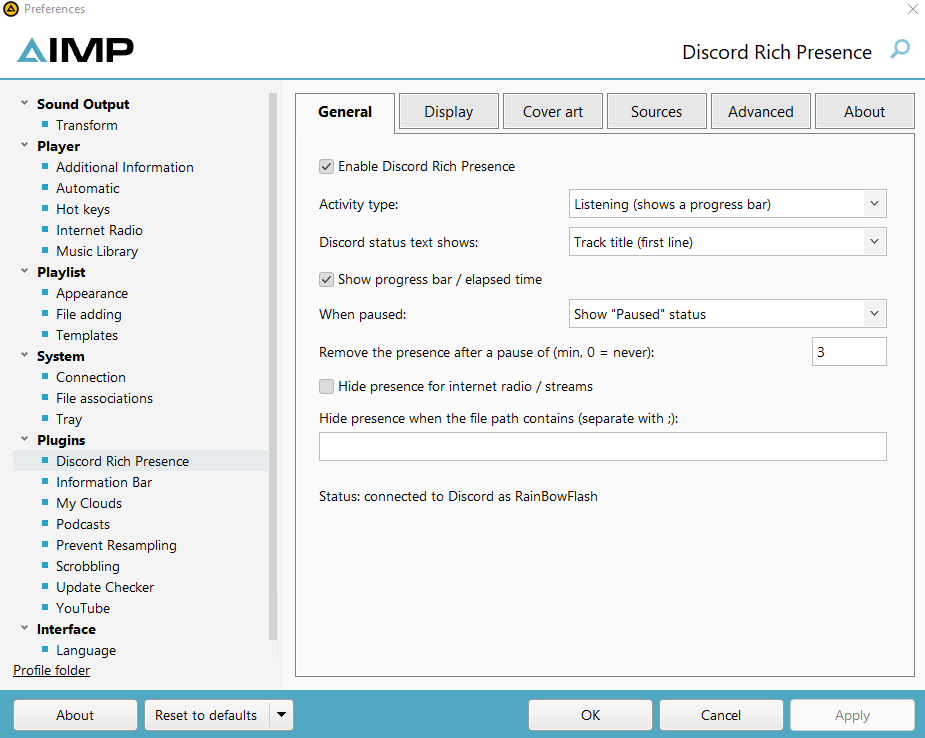</td>
    <td width="50%"><b>Display</b> - with the live preview<br>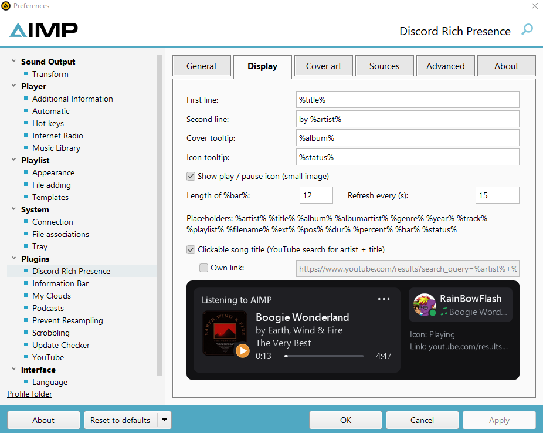</td>
  </tr>
</table>

**Live preview** on the *Display* tab - what Discord will show:

<table>
  <tr>
    <td width="33%"><b>Playing</b><br>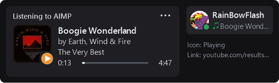</td>
    <td width="33%"><b>Paused</b> (<i>Show "Paused" status</i>)<br>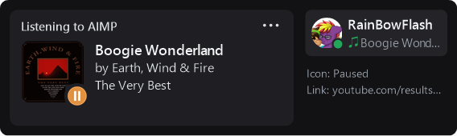</td>
    <td width="33%"><b>Paused</b> (<i>Hide</i>) - tells why<br>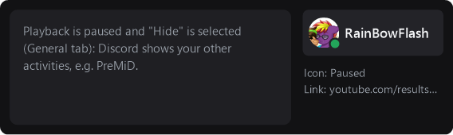</td>
  </tr>
</table>

<table>
  <tr>
    <td width="50%"><b>Cover art</b> - current cover and its source<br>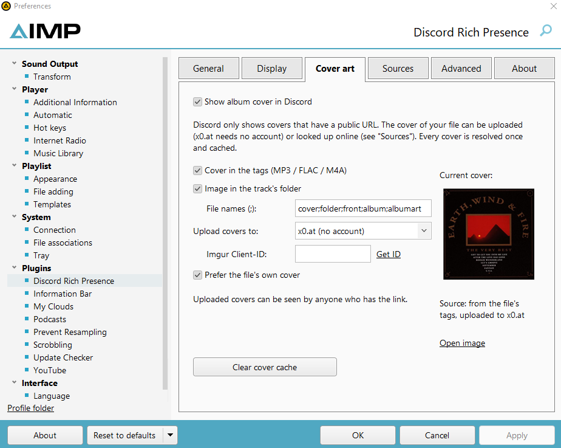</td>
    <td width="50%"><b>Sources</b><br>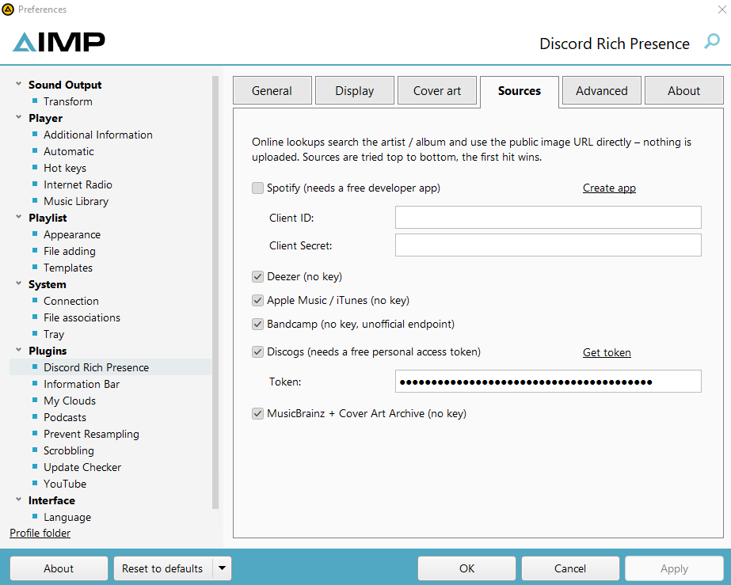</td>
  </tr>
  <tr>
    <td><b>Advanced</b> - diagnostics, language, export<br>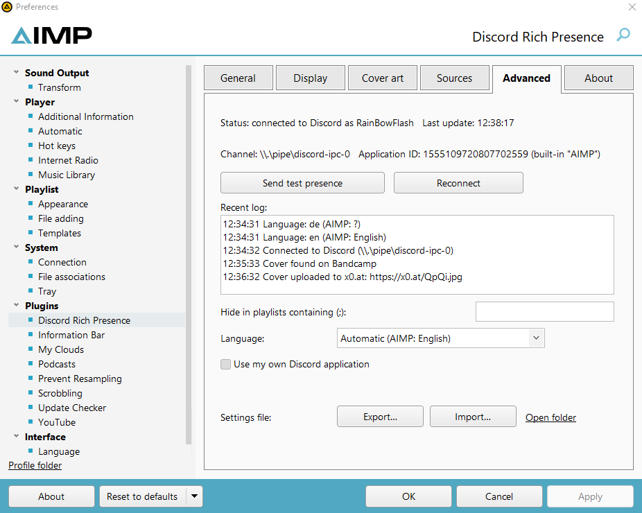</td>
    <td><b>About</b> - update check and changelog<br>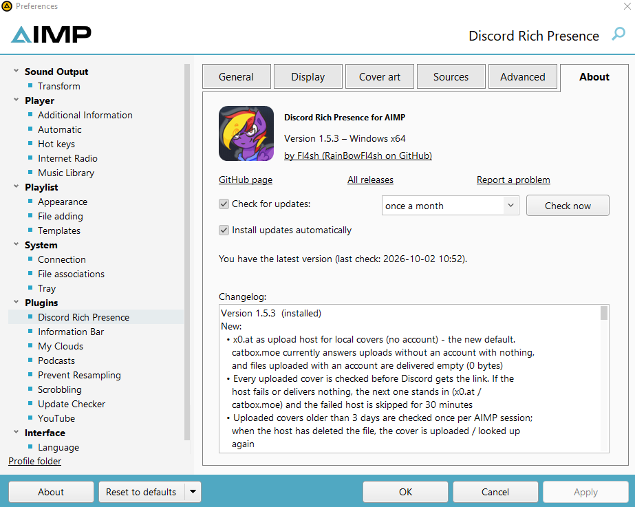</td>
  </tr>
</table>

## Update check

On the *About* tab: *Check for updates* (at every AIMP start, once a day, once a week or once a month) and
*Install updates automatically*. The plugin asks GitHub for the newest release of this project
(`api.github.com`, nothing else is sent). If it is newer, the `.aimppack` of the release is downloaded, checked
against the SHA-256 checksum GitHub publishes for it and opened in AIMP, which installs it. As soon as the new plugin file is in place, the plugin restarts AIMP so the
new version is loaded (AIMP itself would only offer "Restart now"). A new version is opened automatically only once; afterwards the *Install* button on the *About* tab does it.
If automatic installation is off, AIMP shows a short notice instead. Downloaded packages are kept in
the `DiscordRPC` folder in AIMP's profile folder (see [Files](#files)) and removed after the update.

## Languages

The plugin uses AIMP's interface language. Built in: English, Deutsch, Русский, Українська. Another language can
be chosen on the *Advanced* tab.

> **Note:** the **Russian** and **Ukrainian** translations (texts of the plugin and the translated changelogs) were
> made with the help of AI. They may contain mistakes or sound unnatural in places - corrections from native
> speakers are very welcome (see below).

**Add or correct a translation:** copy [`langs/english.lng`](langs/english.lng) to a `Langs` folder next to the
plugin (e.g. `AIMP\Plugins\aimp_discord_rpc\Langs\polish.lng`), set `Name`, `Code` and `Aliases` in the `[FILE]`
section and translate the texts - no rebuild needed (restart AIMP). A file with the `Code` of a built-in language
corrects single texts of it. Translations sent as a pull request or issue are welcome and will be built in.

## Linux

### Native AIMP for Linux

Runs on practically every x86_64 distribution (glibc 2.17 or newer). The `.aimppack` contains it as well.

1. Download `aimp_discord_rpc.aimppack` (open it with AIMP) **or** `aimp_discord_rpc-linux-x86_64.zip`
2. For the zip: extract it into AIMP's `Plugins` folder - this creates `Plugins/aimp_discord_rpc/aimp_discord_rpc.so`
   (the folder name must match the file name)
3. Restart AIMP and tick the plugin in *Preferences -> Plugins*

The settings tab is the same as on Windows (*Preferences -> Plugins -> Discord Rich Presence*).
The options are stored in `~/.config/AIMP/DiscordRPC.ini` (or `$XDG_CONFIG_HOME/AIMP/DiscordRPC.ini`), which is
created with every option on the first start. You can also edit this file by hand - changes are picked up
**while AIMP is running** (within ~2 s, on Windows too). The keys are the same on both systems, e.g.:

```ini
[DiscordRPC]
Details=%title%
State=by %artist%
; 0 = show "Paused", 1 = hide while paused
PausedBehavior=1
CoverEnabled=1
; local covers: 0 = off, 1 = catbox.moe, 2 = Imgur, 3 = x0.at
UploadHost=3
```

Comments must be on their own line (`;` or `#`). The file is UTF-8 on Linux and UTF-16 on Windows (both are read on
both systems, so an exported file works everywhere).

Online cover lookup / upload uses the system's `libcurl` (installed on practically every distribution). Without it
the presence still works, just with the AIMP logo instead of covers. Debug output: start AIMP with
`AIMP_DISCORD_RPC_DEBUG=1`.

### Windows AIMP in Wine

Install the Windows DLL that matches your AIMP (x86 or x64) into the Wine prefix as described above. There is no
Discord named pipe inside Wine, so the plugin detects Wine and talks to the **Linux** Discord client's socket
(`$XDG_RUNTIME_DIR/discord-ipc-N`) directly - no bridge program needed. If you already use a bridge such as
wine-discord-ipc-bridge, that keeps working as well (the named pipe is tried first).

## Files

All files are kept in **AIMP's profile folder** - usually `%APPDATA%\AIMP\` (Linux: `~/.config/AIMP/`), with a
portable AIMP `AIMP\Profile\`. *Open folder* on the *Advanced* tab opens it. (Versions before 1.5.3 always used
`%APPDATA%\AIMP\`; a portable AIMP takes the settings over from there once.)

- Settings: `DiscordRPC.ini` - export / import on the *Advanced* tab
- Cover cache: `DiscordRPC_covers.tsv`; can also be cleared in the *Cover art* tab
- Pictures for the settings page (avatar, Discord images) and downloaded updates: the folder `DiscordRPC\`
- Own / corrected translations: `Langs\*.lng` next to the plugin (see [Languages](#languages))

## Cover sources

| Source | Key needed | Notes |
|---|---|---|
| Local cover -> x0.at | no | public link; kept for days (big files) to months (small files) - expired covers are uploaded again |
| Local cover -> catbox.moe | no | public link (in October 2026 catbox.moe answered uploads without an account with nothing and delivered empty files - x0.at stands in) |
| Local cover -> Imgur | Client-ID | api.imgur.com/oauth2/addclient (*Get ID* link) |
| Spotify | Client ID + Secret | developer.spotify.com/dashboard |
| Deezer | no | |
| Apple Music / iTunes | no | |
| Bandcamp | no | unofficial endpoint, may change |
| Discogs | personal token | discogs.com/settings/developers |
| MusicBrainz / Cover Art Archive | no | |

The presence looks the same for everyone: Discord loads the public cover URL itself.

## Notes

- Uploaded covers (x0.at / catbox.moe / Imgur) are reachable by anyone who has the link. Uploading can be turned off in the *Cover art* tab.
- Online lookups match by artist + album / title, so wrong or missing covers are possible for obscure releases.
- Discord limits updates, so changes are combined (max. one update every 2 seconds).
- Embedded covers are not read from Ogg/Opus, WMA and APE files (folder image / online lookup still work).
- While music plays and PreMiD is active at the same time, Discord shows both activities; Discord decides the order.
- Network access: the cover sources above, `api.github.com` / `github.com` for the update check (can be switched
  off), and - only while the settings page is open - GitHub (author picture) and Discord's CDN (the pictures of
  the Discord application and your Discord avatar for the preview).

### Advanced: own Discord application

Normally not needed. Tick *Advanced -> Use my own Discord application* and enter its Application ID.
The application needs the art assets `aimp`, `play` and `pause` (Developer Portal -> Rich Presence -> Art Assets).

## Changelog

The full list of changes is in [CHANGELOG.md](CHANGELOG.md) (also in [Deutsch](langs/changelog.de.md),
[Русский](langs/changelog.ru.md) and [Українська](langs/changelog.uk.md) - Russian and Ukrainian translated with AI)
and on the plugin's *About* tab.

**1.5.3** - Now also for **AIMP 4** (fully supported) and, slightly limited, **AIMP 3**. Local covers are uploaded to **x0.at** (no account) - catbox.moe currently rejects uploads without an
account and delivers uploaded files empty. Every upload is checked before Discord gets the link; if a host fails,
another one stands in. Uploaded covers that the host deleted are uploaded again. Covers Discord cannot load
("?") are repaired. Updates restart AIMP automatically once installed. Fixed: empty live preview / author picture
in 32-bit AIMP, "Invalid pointer operation" when closing the preferences in AIMP 4.70.

<details>
<summary>Older versions</summary>

**1.5.2** - *Export* / *Import* on the *Advanced* tab open the Windows file dialog (they did nothing on Windows).
catbox.moe uploads are no longer redirected and failures are logged with details.

**1.5.1** - All tabs keep a margin on the right (nothing is cut off any more). *Get ID* link for the Imgur
Client-ID. "Reconnecting..." changes to "Connected." and disappears. Rounded author picture. The changelog on the
*About* tab is shown in the plugin's language.

**1.5.0** - New *About* tab (author, links, complete changelog) and *Advanced* tab (connection details, test
presence, reconnect, log, playlist filter, language, export / import). **Update check** with automatic install.
**Live preview** of the Discord card on the *Display* tab and **cover preview** on the *Cover art* tab. The plugin
follows AIMP's language (English, German, Russian, Ukrainian). New placeholder `%playlist%`. Linux build runs on
glibc 2.17+ (practically every distribution). Less than half the file size.

**1.4.1** - Fixed the settings layout (controls were scattered or cut off in 1.4.0).

**1.4.0** - Settings tab on Linux too: the page is built with AIMP's own UI API and follows the AIMP skin. One
`.aimppack` for all platforms.

**1.3.0** - Windows 32-bit and native Linux builds, Wine support without a bridge, clickable song title (YouTube
search), works without your own Discord application, presence hidden while paused (PreMiD friendly).

</details>

## Build from source

Built and tested against the **AIMP SDK 6.00** (C++ headers). The SDK headers are not part of this repository's license.

**GitHub Actions (no Visual Studio needed):** put the C++ headers of the AIMP SDK (`Sources\Cpp`, including `Helpers`)
into `sdk/`, push, then open *Actions -> Build*. The run builds and attaches `aimp_discord_rpc-windows-x64`,
`aimp_discord_rpc-windows-x86`, `aimp_discord_rpc-linux-x86_64` and the ready-to-release `aimp_discord_rpc.aimppack`.
It also tests the Linux plugin and both Windows DLLs (under Wine) with a mock AIMP host - including the settings
page through a mock of AIMP's UI service, the live preview (rendered to images), the language switch,
export / import and the update check - against a fake Discord client and a fake web server (`tests/`).
`tests/check_langs.py` checks that every language file has all texts.

**Windows:** copy the SDK headers into `sdk/` and run `build.bat x64` or `build.bat x86` (Visual Studio 2022 with C++
workload + CMake), or:

```
cmake -S . -B build -A x64 -DAIMP_SDK_DIR="C:/path/to/AIMP_SDK/Sources/Cpp"     (32-bit: -A Win32)
cmake --build build --config Release
```

Result: `build/Release/aimp_discord_rpc.dll`

**Linux (native plugin):** needs a C++17 compiler, CMake and the headers of libcurl and cairo
(Debian/Ubuntu: `sudo apt install build-essential cmake libcurl4-openssl-dev libcairo2-dev`):

```
cmake -S . -B build -DCMAKE_BUILD_TYPE=Release
cmake --build build
tests/run_linux_test.sh build      # optional: cmake --build build --target host_test first
```

Result: `build/aimp_discord_rpc.so` - it needs at least the glibc version of the build machine. The released `.so`
is built with `tools/build_linux_portable.sh build` instead (zig, `pip install ziglang`): it runs with glibc 2.17+.

**Windows DLLs on Linux (MinGW cross-compile):** `sudo apt install mingw-w64`, then

```
cmake -S . -B build-win-x86 -DCMAKE_TOOLCHAIN_FILE=cmake/mingw-x86.cmake    (64-bit: cmake/mingw-x64.cmake)
cmake --build build-win-x86
```

**Creating the .aimppack:** an `.aimppack` is a ZIP archive. `tools/make_aimppack.py` builds it with all platforms:

```
python3 tools/make_aimppack.py --x86 <x86 dll> --x64 <x64 dll> --linux <so> --out aimp_discord_rpc.aimppack
```

Layout: the x86 DLL in `aimp_discord_rpc/`, the x64 DLL in `aimp_discord_rpc/x64/`, the Linux `.so` in both folders
and `aimp_discord_rpc.txt` with name / version / author. The translations (`langs/*.lng`) and the changelogs
(`CHANGELOG.md`, `langs/changelog.*.md`) are compiled into the plugin.

**Publishing a release (for the update check):** the release title or tag must contain the version number
(e.g. tag `v1.5.3`), and `aimp_discord_rpc.aimppack` must be attached (attach the three manual zips
`aimp_discord_rpc-windows-x64.zip`, `aimp_discord_rpc-windows-x86.zip` and `aimp_discord_rpc-linux-x86_64.zip` as well,
each containing the folder `aimp_discord_rpc/` with the plugin). The update check reads the newest release
from `https://api.github.com/repos/RainBowFl4sh/AIMP-Discord-RP-v4-v6--Win32_64Bit--Linux/releases/latest`.
