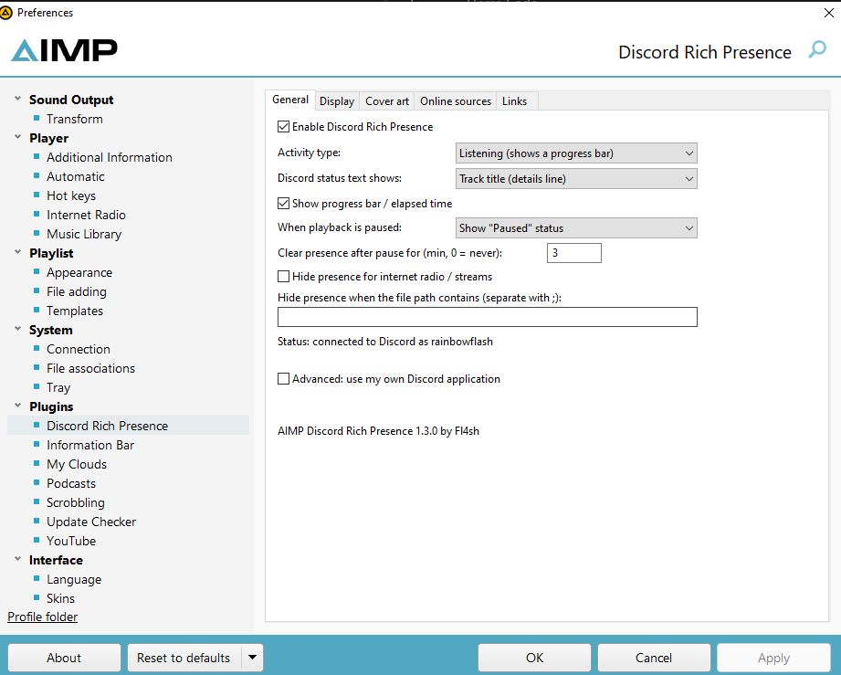
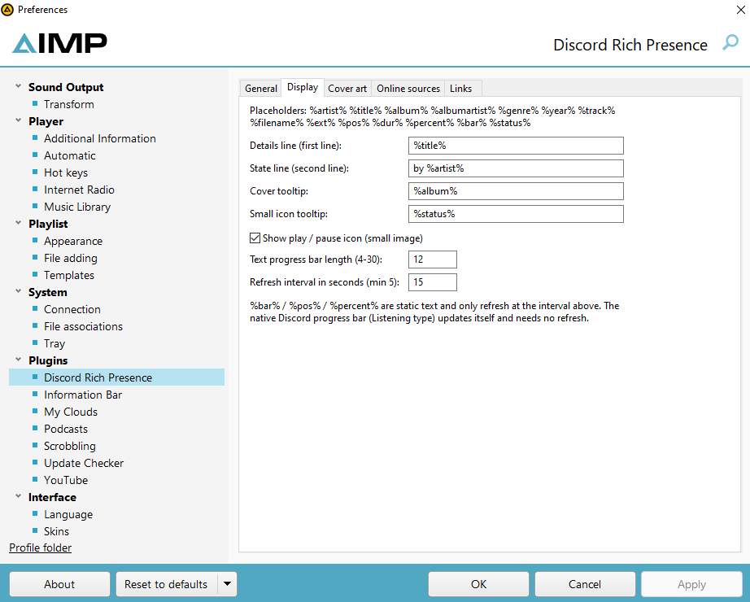
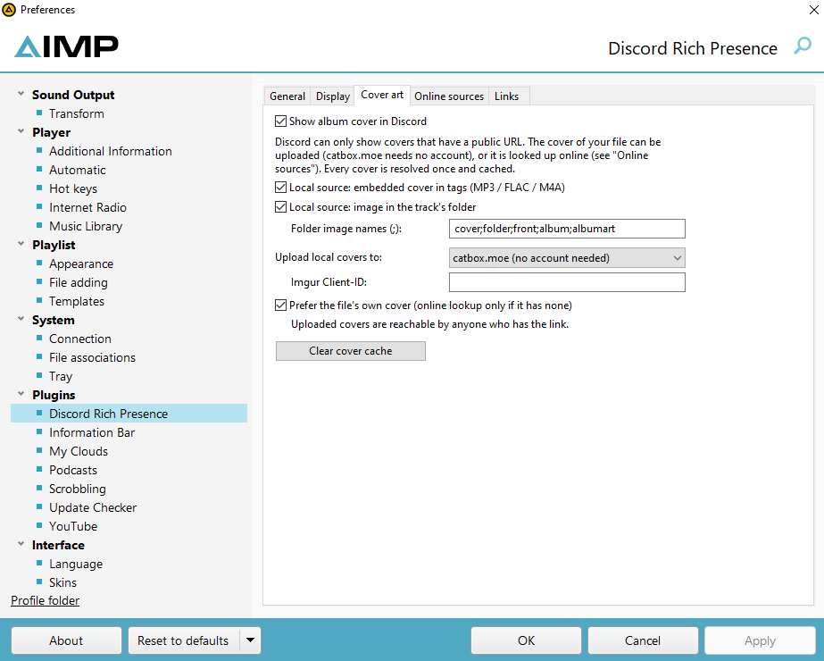
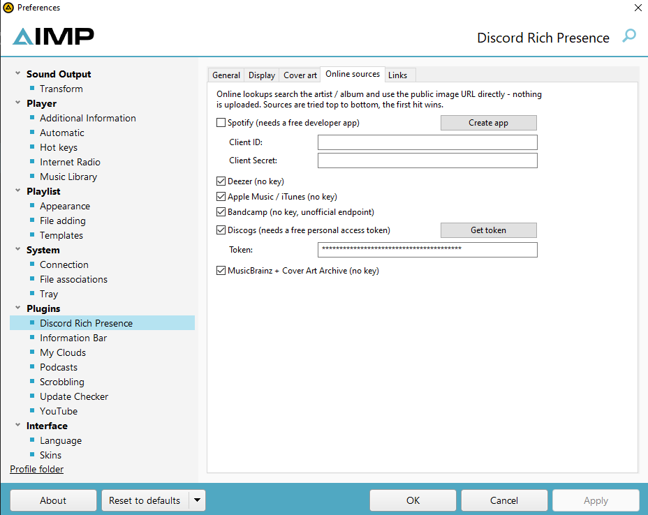
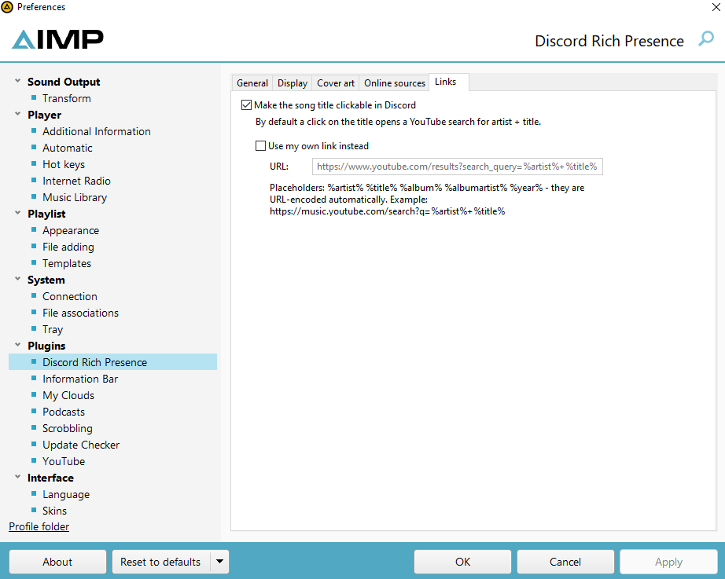

# AIMP Discord Rich Presence (Windows x86 / x64 + Linux)

Discord Rich Presence plugin for AIMP 5 and 6 with its own settings tab inside AIMP's preferences.

| Platform | File |
|---|---|
| Windows, AIMP **64-bit** | `aimp_discord_rpc.dll` from `aimp_discord_rpc-windows-x64` |
| Windows, AIMP **32-bit** | `aimp_discord_rpc.dll` from `aimp_discord_rpc-windows-x86` |
| Linux, **native** AIMP for Linux (x86_64) | `aimp_discord_rpc.so` from `aimp_discord_rpc-linux-x86_64` |
| Linux, Windows AIMP running in **Wine** | the Windows DLL matching your AIMP (x86 or x64) - see [Linux](#linux) |

Author: **Fl4sh**

## Features

- Track title / artist / album on your Discord profile with Discord's **native progress bar** ("Listening to AIMP")
- Album cover:
  - the file's own cover (tags MP3 / FLAC / M4A or folder image) is uploaded to **catbox.moe** (no account / key needed) or Imgur (Client-ID)
  - online lookup without upload: **Spotify** (free developer app), **Deezer**, **Apple Music / iTunes**, **Bandcamp**, **Discogs** (free token), **MusicBrainz + Cover Art Archive**
  - artist check against every hit to avoid wrong covers; covers are cached on disk
- AIMP logo as fallback if no cover is found
- Clickable song title: opens a YouTube search for artist + title (own link optional)
- PreMiD friendly: while AIMP is paused its presence is hidden, so your browser activity (PreMiD) is shown instead
- Works out of the box - no Discord application or key needed
- Own settings tab: *Preferences -> Plugins -> Discord Rich Presence* (General / Display / Cover art / Online sources / Links)
- Text templates with placeholders: `%artist% %title% %album% %albumartist% %genre% %year% %track% %filename% %ext% %pos% %dur% %percent% %bar% %status%`
- Play/pause small icon, paused behaviour (show "Paused" / hide / hide after N minutes)
- Internet radio: shows the current song of the stream; can also be hidden completely
- Hide for paths containing given text (e.g. podcasts, audiobooks)
- Auto reconnect when Discord starts later, live connection status, presence is cleared when AIMP closes

## Requirements

- AIMP 5 or 6: Windows 32-bit or 64-bit, or the native Linux version (x86_64)
- Discord **desktop app** (the browser version of Discord cannot receive Rich Presence).
  On Linux the native client, Flatpak, Snap and Vesktop (Flatpak) are found automatically.
- In Discord: *User Settings -> Activity Privacy -> "Share your detected activities with others"* must be on

## Install

Download the latest version from the [Releases](../../releases) page. **Pick the build that matches your AIMP:**
a 64-bit AIMP only loads the x64 DLL, a 32-bit AIMP only the x86 DLL (*Help -> About* shows which one you have).

There are three ways to install it on Windows:

### Option 1: AIMP package (easiest)

1. Download `aimp_discord_rpc.aimppack`
2. **Double-click** the file - AIMP opens and installs the plugin automatically
3. Restart AIMP if it asks you to

### Option 2: Install button in AIMP

1. Download `aimp_discord_rpc.aimppack` **or** `aimp_discord_rpc.dll`
2. In AIMP open *Preferences -> Plugins* and click **Install** at the bottom
3. Select the downloaded file and restart AIMP if asked

### Option 3: Manual

1. Create the folder `AIMP\Plugins\aimp_discord_rpc\` (the folder name must match the DLL name)
2. Copy `aimp_discord_rpc.dll` into it
3. Restart AIMP

### After installing

Make sure the plugin is ticked in *Preferences -> Plugins*. As soon as music is playing, Discord shows
"Listening to AIMP". All options are in *Preferences -> Plugins -> Discord Rich Presence*.

**Updating:** simply install the new version the same way - your settings are kept.

## Settings

All options are in AIMP under *Preferences -> Plugins -> Discord Rich Presence* (Windows; on Linux see
[Native AIMP for Linux](#native-aimp-for-linux) - same options, in an INI file).

**General** - on/off, activity type (Listening with progress bar / Playing), what the Discord status shows, paused
behaviour, hiding streams or paths, live connection status, own Discord application (advanced)



**Display** - text templates for both lines and the tooltips, play / pause icon, text progress bar



**Cover art** - local covers (tags / folder image), upload host (catbox.moe or Imgur), cover cache



**Online sources** - cover lookup on Spotify, Deezer, Apple Music / iTunes, Bandcamp, Discogs, MusicBrainz



**Links** - clickable song title (YouTube search by default, or your own link)



## Linux

### Native AIMP for Linux

1. Download `aimp_discord_rpc.so` (x86_64)
2. Create the folder `aimp_discord_rpc` in AIMP's `Plugins` folder (the folder name must match the file name)
   and copy `aimp_discord_rpc.so` into it
3. Restart AIMP and tick the plugin in *Preferences -> Plugins*

The Linux version has no settings tab (AIMP for Linux uses a different UI toolkit). All options are in
`~/.config/AIMP/DiscordRPC.ini` (or `$XDG_CONFIG_HOME/AIMP/DiscordRPC.ini`), which is created with every option and
its default value on the first start. Changes to the file are picked up **while AIMP is running** (within ~2 s).
The keys are the same as on Windows, e.g.:

```ini
[DiscordRPC]
details=%title%
state=by %artist%
; 0 = show "Paused", 1 = hide while paused
pausedbehavior=1
coverenabled=1
; local covers: 0 = off, 1 = catbox.moe, 2 = Imgur
uploadhost=1
```

Comments must be on their own line (`;` or `#`), the file is UTF-8.

Online cover lookup / upload uses the system's `libcurl` (installed on practically every distribution). Without it
the presence still works, just with the AIMP logo instead of covers. Debug output: start AIMP with
`AIMP_DISCORD_RPC_DEBUG=1`.

### Windows AIMP in Wine

Install the Windows DLL that matches your AIMP (x86 or x64) into the Wine prefix as described above. There is no
Discord named pipe inside Wine, so the plugin detects Wine and talks to the **Linux** Discord client's socket
(`$XDG_RUNTIME_DIR/discord-ipc-N`) directly - no bridge program needed. If you already use a bridge such as
wine-discord-ipc-bridge, that keeps working as well (the named pipe is tried first).

## Files

- Settings: `%APPDATA%\AIMP\DiscordRPC.ini` (Linux: `~/.config/AIMP/DiscordRPC.ini`)
- Cover cache: `%APPDATA%\AIMP\DiscordRPC_covers.tsv` (Linux: `~/.config/AIMP/DiscordRPC_covers.tsv`; on Windows it
  can also be cleared in the *Cover art* tab)

## Cover sources

| Source | Key needed | Notes |
|---|---|---|
| Local cover -> catbox.moe | no | public link, permanent |
| Local cover -> Imgur | Client-ID | |
| Spotify | Client ID + Secret | developer.spotify.com/dashboard |
| Deezer | no | |
| Apple Music / iTunes | no | |
| Bandcamp | no | unofficial endpoint, may change |
| Discogs | personal token | discogs.com/settings/developers |
| MusicBrainz / Cover Art Archive | no | |

The presence looks the same for everyone: Discord loads the public cover URL itself.

## Notes

- Uploaded covers (catbox.moe / Imgur) are reachable by anyone who has the link. Uploading can be turned off in the *Cover art* tab.
- Online lookups match by artist + album / title, so wrong or missing covers are possible for obscure releases.
- Discord limits updates, so changes are combined (max. one update every 2 seconds).
- Embedded covers are not read from Ogg/Opus, WMA and APE files (folder image / online lookup still work).
- While music plays and PreMiD is active at the same time, Discord shows both activities; Discord decides the order.

### Advanced: own Discord application

Normally not needed. Tick *General -> Advanced: use my own Discord application* and enter its Application ID.
The application needs the art assets `aimp`, `play` and `pause` (Developer Portal -> Rich Presence -> Art Assets).

## Build from source

Built and tested against the **AIMP SDK 6.00** (C++ headers). The SDK headers are not part of this repository's license.

**GitHub Actions (no Visual Studio needed):** put the C++ headers of the AIMP SDK (`Sources\Cpp`, including `Helpers`)
into `sdk/`, push, then open *Actions -> Build*. The run builds and attaches `aimp_discord_rpc-windows-x64`,
`aimp_discord_rpc-windows-x86` and `aimp_discord_rpc-linux-x86_64`, and tests the Linux plugin and both Windows DLLs
(under Wine) with a mock AIMP host and a fake Discord client (`tests/`).

**Windows:** copy the SDK headers into `sdk/` and run `build.bat x64` or `build.bat x86` (Visual Studio 2022 with C++
workload + CMake), or:

```
cmake -S . -B build -A x64 -DAIMP_SDK_DIR="C:/path/to/AIMP_SDK/Sources/Cpp"     (32-bit: -A Win32)
cmake --build build --config Release
```

Result: `build/Release/aimp_discord_rpc.dll`

**Linux (native plugin):** needs a C++17 compiler, CMake and the headers of libcurl and cairo
(Debian/Ubuntu: `sudo apt install build-essential cmake libcurl4-openssl-dev libcairo2-dev`):

```
cmake -S . -B build -DCMAKE_BUILD_TYPE=Release
cmake --build build
tests/run_linux_test.sh build      # optional: cmake --build build --target host_test first
```

Result: `build/aimp_discord_rpc.so`

**Windows DLLs on Linux (MinGW cross-compile):** `sudo apt install mingw-w64`, then

```
cmake -S . -B build-win-x86 -DCMAKE_TOOLCHAIN_FILE=cmake/mingw-x86.cmake    (64-bit: cmake/mingw-x64.cmake)
cmake --build build-win-x86
```

**Creating the .aimppack:** an `.aimppack` is simply a ZIP archive containing the plugin, renamed from `.zip` to `.aimppack`.
